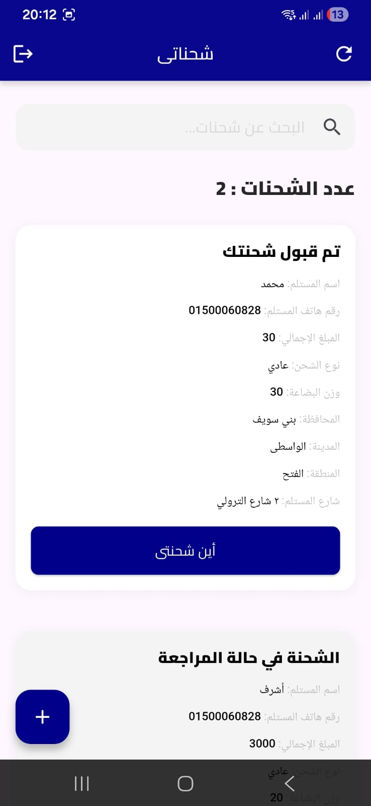
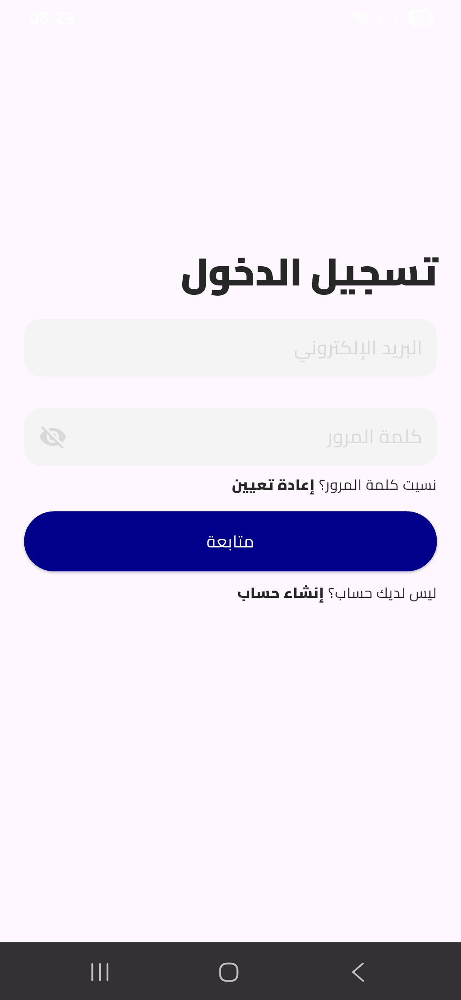
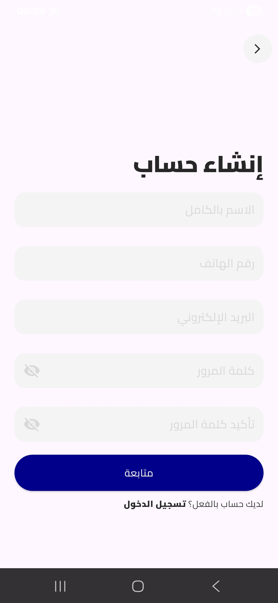
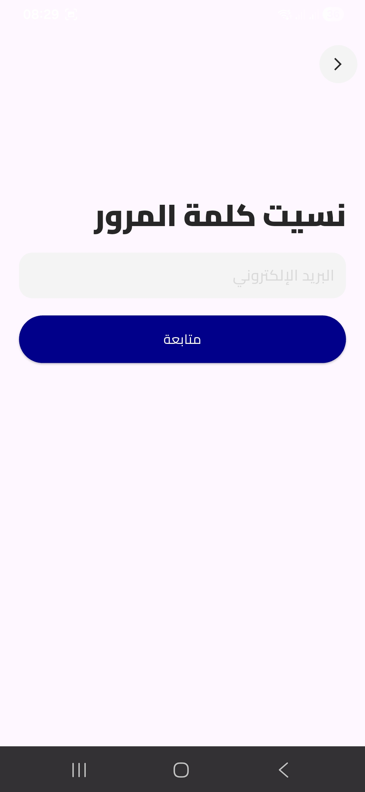
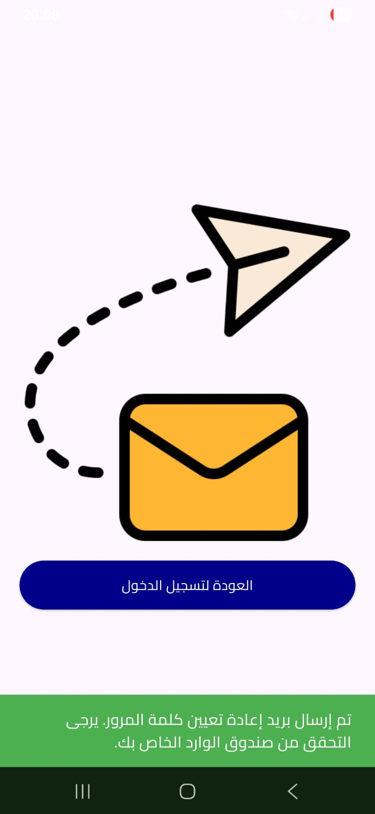
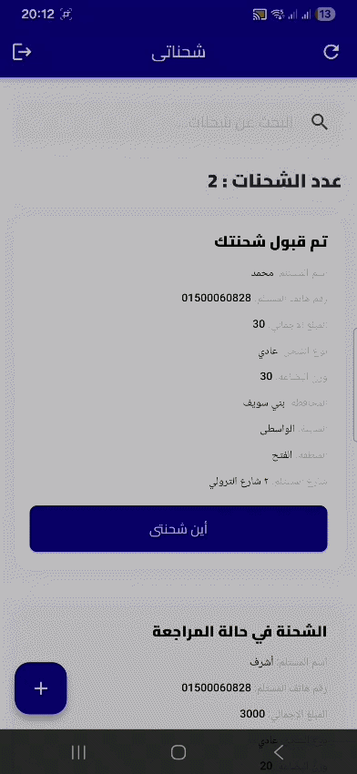

 

 

> *"Fast. Reliable. Trackable — Your shipments, always in your hands."*

 

---

## 📖 About EUX Client

**EUX Client** is a professional mobile application built with Flutter for a shipping and logistics company. It enables clients to register, log in, and track their shipments in real time — all from a clean and intuitive mobile interface.

The app supports both **Arabic** and **English**, with a smooth and responsive UI designed for all screen sizes.

---

## ✨ Key Features

- 🔗 **JLT Integration** — Fully integrated with JLT shipping company's system
- 🌐 **Arabized APIs** — All API responses are localized and displayed in Arabic
- 🏠 **Home** — Dashboard overview with quick access to shipment actions
- 🔐 **Login** — Secure user authentication
- 📝 **Sign Up** — New account registration flow
- 🔑 **Reset Password** — Forgot password recovery flow
- 📧 **Send Email** — Email verification / confirmation screen
- 📦 **Tracking Details** — Real-time shipment tracking with full details
- 🌍 **Multi-Language** — Arabic (RTL) & English (LTR) support
- 📱 **Cross-Platform** — Runs on both Android & iOS

---

## 📸 Screenshots

 
| Home | Login | Sign Up |
|:----:|:-----:|:-------:|
|  |  |  |
 
| Reset Password | Send Email | Tracking Details |
|:--------------:|:----------:|:----------------:|
|  |  |  |
 

 

---

## 🛠️ Tech Stack

| Technology | Usage |
|:-----------|:------|
| **Flutter** | Cross-platform mobile framework |
| **Dart** | Core programming language |
| **REST API** | Backend communication |
| **Network Validation** | Internet connectivity checks before API calls |

---

## 📄 Key Screens & Flow

| Screen | Description |
|:-------|:-----------|
| 🏠 **Home** | Main dashboard after login |
| 🔐 **Login** | Email & password authentication |
| 📝 **Sign Up** | New user registration |
| 🔑 **Reset Password** | Password recovery request |
| 📧 **Send Email** | Email verification confirmation |
| 📦 **Tracking Details** | Full shipment tracking info |
---

## 👤 Developer

**Muhammed Ashraf Saleh**

---

## 📄 License

This project is proprietary software developed for **EUX**. All rights reserved © 2025.

---

*Built with ❤️ using Flutter & Dart*

